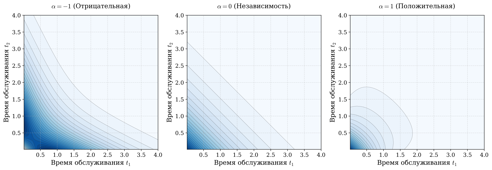
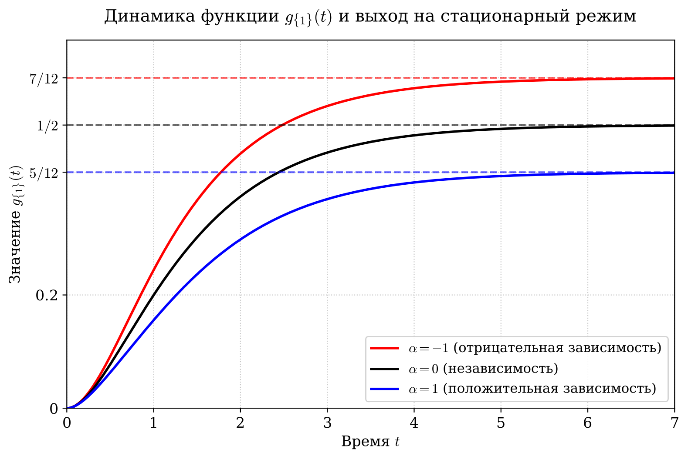
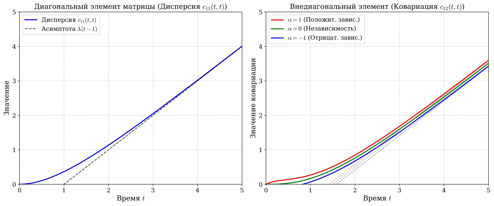

# Departure process of the $M^k/G/\infty$ batch-arrival queue

Analysis and numerical implementation of the infinite-server queue $M^k/G/\infty$ with batch arrivals of **heterogeneous** and **dependent** demands. A direct extension of the classical result of G.I. Falin (1994) to the previously unstudied departure process $D(t)$.

> Salimov A.E. *Departure process in an infinite-server queue with batch arrivals of heterogeneous dependent demands.* M.V. Lomonosov Moscow State University, Faculty of Mechanics and Mathematics, Department of Probability Theory, 2026. Supervisor: Prof. G.I. Falin, Dr. Sc.

> **🏅 The talk based on this work received an award at a student conference.** Certificate scan: [`awards/conference_certificate.pdf`](awards/conference_certificate.pdf).

The full course paper PDF and LaTeX source are in [`paper/`](paper/).

## Problem

The queue receives a Poisson stream of batches of intensity $\lambda$, each batch has a fixed number $k$ of demands of distinct types, with infinitely many servers and generally **dependent** within-batch service times. The vector $\tau = (\tau_1, \ldots, \tau_k)$ has an arbitrary joint distribution.

The focus is on the departure process $D(t) = (D_1(t), \ldots, D_k(t))$ where $D_i(t)$ counts the demands of type $i$ that have left the system by time $t$.

## Main result (decomposition theorem)

$$D(t) = B \cdot \delta(t),$$

where $\delta(t) = (\delta_y(t))_{y \subseteq S}$ is a $2^k$-dimensional random vector with **independent** Poisson components,

$$\delta_y(t) \sim \mathrm{Pois}(\lambda g_y(t)),\qquad g_y(t) = \int_0^t \mathbb{P}\big(\{\tau_i \le u\}_{i \in y} \cap \{\tau_i > u\}_{i \notin y}\big)\,du,$$

and $B \in \{0, 1\}^{k \times 2^k}$ is the incidence matrix $b_{iy} = \mathbb{I}(i \in y)$.

The decomposition reduces analysis of a multivariate dependent process to independent one-dimensional components and replaces the heavy generating-function machinery of Abolnikov (1968) and Choi–Park (1992) with a transparent probabilistic argument.

## Covariance analysis

**Cross-covariance of $N(t)$ and $D(t)$:**

$$\mathrm{Cov}(N_i(t), D_j(t)) = \lambda \sum_{\substack{y \subseteq S \\ i \in y,\, j \notin y}} g_y(t).$$

Diagonal entries vanish — in fact, $N_i(t)$ and $D_i(t)$ are **independent**. Off-diagonal entries are strictly positive.

**Auto-covariance of $D(t)$** (proved via interval partitioning of the Poisson process):

$$\mathrm{Cov}(D_i(t_1), D_j(t_2)) = \lambda \int_0^{t_1} \mathbb{P}(u + \tau_i \le t_1,\; u + \tau_j \le t_2)\,du.$$

## Closed-form FGM case ($k = 2$)

Service times $\tau_1, \tau_2$ follow a Farlie–Gumbel–Morgenstern distribution with $\mathrm{Exp}(1)$ marginals:

$$F(t_1, t_2) = (1 - e^{-t_1})(1 - e^{-t_2})(1 + \alpha e^{-t_1 - t_2}),\qquad \alpha \in [-1, 1].$$

The parameter $\alpha$ controls within-batch dependence: $\alpha = 0$ — independence, $\alpha > 0$ — positive correlation, $\alpha < 0$ — negative.



**Function $g_{\{1\}}(t)$:**

$$g_{\{1\}}(t) = (1 - e^{-t}) - \frac{\alpha + 1}{2}(1 - e^{-2t}) + \frac{2\alpha}{3}(1 - e^{-3t}) - \frac{\alpha}{4}(1 - e^{-4t}),$$

$$\lim_{t \to \infty} g_{\{1\}}(t) = \frac{1}{2} - \frac{\alpha}{12}.$$



**Entries of $\mathrm{Cov}(D(t_1), D(t_2))$:**

- Diagonal: $c_{ii}(t_1, t_2) = \lambda(\min(t_1, t_2) - 1 + e^{-\min(t_1, t_2)})$
- Off-diagonal: a long expression implemented in `cov_dd_offdiag_fgm` (formula (8) of the thesis)



## A "correlation conservation law"

The central probabilistic conclusion is the asymptotic full correlation of the departure streams:

$$\lim_{t \to \infty} \rho_{12}(t) = \lim_{t \to \infty} \frac{\mathrm{Cov}(D_1(t), D_2(t))}{\sqrt{\mathrm{Var}(D_1(t))\,\mathrm{Var}(D_2(t))}} = 1.$$

The parameter $\alpha$ acts only as a local additive correction on finite time scales. In the limit, the **mere fact of batched arrivals** drives full synchronisation of the departure streams, regardless of internal service-time dependence.

## Repository layout

```
queueing-mk-g-inf/
├── src/queue_mkginf.py       # FGM, g_y(t), covariance kernels, simulator
├── tests/test_queue.py       # pytest: limit values, simulation cross-check
├── paper/                    # thesis (PDF + LaTeX)
├── figures/                  # plots from the thesis (FGM, g_{1}, covariance)
├── awards/                   # conference certificate
├── requirements.txt
└── LICENSE
```

## Installation

```bash
git clone https://github.com/<your-username>/queueing-mk-g-inf.git
cd queueing-mk-g-inf
pip install -r requirements.txt
pytest tests/ -v
```

## Usage example

```python
import numpy as np
from src.queue_mkginf import (
    g_single_fgm, g_single_fgm_limit,
    cov_dd_fgm, correlation_dd_fgm,
    simulate_mk_g_inf, fgm_service_sampler,
)

print(g_single_fgm(np.array(100.0), alpha=0.5))   # ≈ 1/2 - 0.5/12
print(g_single_fgm_limit(alpha=0.5))              # exactly 1/2 - 0.5/12

print(cov_dd_fgm(t1=2.0, t2=3.0, alpha=0.5))
print(correlation_dd_fgm(t=100.0, alpha=0.5))     # ≈ 1.0

result = simulate_mk_g_inf(
    lam=1.0, horizon=5.0,
    grid=np.array([1.0, 2.0, 5.0]),
    service_sampler=fgm_service_sampler(alpha=0.0),
    n_replicas=2000,
)
```

## References

Full bibliography in `paper/thesis.tex`. Key works:

- Falin G. (1994). *The $M^k/G/\infty$ batch arrival queue by heterogeneous dependent demands.* J. Appl. Prob., 31(3), 841–846.
- Daw A., Fralix B., Pender J. (2022). *Non-stationary queues with batch arrivals.* arXiv:2008.00625.
- Pang G., Whitt W. (2012). *Infinite-server queues with batch arrivals and dependent service times.* Probab. Eng. Inf. Sci., 26(2).
- Burke P.J. (1956). *The output of a queuing system.* Operations Research, 4(6).
- Gumbel E.J. (1960). *Bivariate exponential distributions.* JASA, 55(292).

## License

[MIT](LICENSE)
